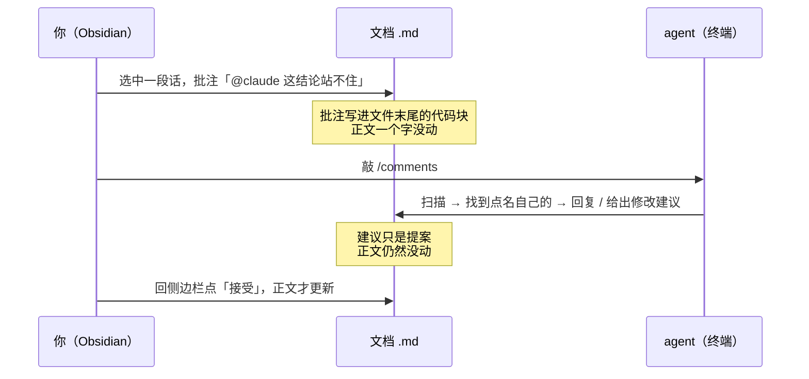

# Agent 工作流 starter kit

用一块 Obsidian 看板管理你和 claude / codex / kimi 的协作：任务从哪来、派给谁、干到哪了、当时的对话在哪——都能在看板上找到答案。

再加一层**文档批注**：审阅意见直接写在文档上，agent 自己去读，不用你回终端复述一遍。

## 解决什么问题

日常和 agent 协作久了会遇到三件烦心事：

1. **任务散**：想法散落在聊天记录里，做没做过、做到哪了没有单一事实源；
2. **会话飞**：多个 claude/codex 会话同时跑，回头想不起哪个会话在干哪件事;
3. **过程丢**：两周后想回看"当时为什么这么定"，对话找不回来了。

这套体系用三个机制对应解决：**看板做单一事实源**（Obsidian Kanban，五列：Backlog → Ready → Agent 进行中 → 待我审 → Done）、**一卡一工作会话**（每张执行卡对应一个专属 agent 会话，派发 prompt 带卡路径完成关联）、**会话指针**（开工时把 session_id + resume 命令登记进卡，随时 `claude --resume` / `codex resume` 回看当时对话）。

## 日常闭环：五个 skill

| skill | 时机 | 干什么 |
|---|---|---|
| `/card` | 随时 | 把对话里讨论出的任务落成任务卡进看板（收） |
| `/today` | 每天早上 | 读看板+报告+OKR，5 分钟对话定今日 2~3 件事并派发（派） |
| `/done` | 每个工作会话结束前 | 把结果回写任务卡、移卡到「待我审」（记账） |
| `/note` | 有值得留的讨论时 | 把决策+理由+被否方案提炼进 `inbox/`（记知，较少用） |
| `/comments` | 审阅 agent 产出时 | 读取你在 Obsidian 里写的批注，逐条答复或给修改建议（评） |

典型的一天：早上 `/today` 挑 2~3 件事 → 执行卡各派一个新会话（prompt 里带卡路径）→ 各会话干完 `/done` 回写 → 你在「👀 待我审」统一验收 → 有价值的讨论顺手 `/note`。中途冒出的新任务随时 `/card` 收进 Backlog，不打断当前事。

## 批注协作：把意见写在文档上

看板管"任务"，批注管"意见"。agent 写完一份文档给你审，你读的时候心里的意见——这段结论站不住、那里漏了个情况——原本只能回终端用嘴复述，位置说不清、语言要重组、事后翻不回来。

装上 Obsidian 的 **Tandem Comments** 插件后，流程变成：



**agent 永远不直接改你的正文**，只能提案，落不落地是你点一下的事。

批注以纯文本 JSON 存在 `.md` 文件末尾，靠"引用原文 + 前后文"定位，所以正文永远是干净的 Markdown，而 agent 不需要任何插件或 API，能读文件就能看见你的意见。

### 多个 agent 分工

| 你写 | 谁会接 |
|---|---|
| `@claude 这段帮我重写` | 只有 Claude |
| `@codex 这个并发写法对吗` | 只有 Codex |
| `@kimi 这句中文别扭` | 只有 Kimi |
| `@ai 随便谁看一眼` | 谁先跑到谁接 |

判定是"状态 open + 你最后那条消息点了名 + 被点名者在那之后没说过话"。所以**你在 agent 回复后再追问一句，它会自动重新变成待办**，可以像聊天一样一来一回。

详细用法、格式说明和踩坑清单见 [docs/obsidian-comments.md](docs/obsidian-comments.md)。

## 三家 CLI 的差异

| CLI | skills 目录 | 斜杠命令 |
|---|---|---|
| Claude Code | `~/.claude/skills` | ✅ skill 自动获得同名斜杠命令 |
| Codex | `~/.codex/skills` | ⚠️ 另一套：`~/.codex/commands/*.md`，要各配一份 |
| Kimi Code | `~/.kimi-code/skills` | ✅ 原生支持 |

Codex 这条最容易踩：skill 装好了模型能自己调用（你说"处理一下批注"它知道），但手打 `/comments` 找不到。补一个几行的转发文件即可，见 [SETUP.md](SETUP.md) 第 4 步。

## Obsidian 的两处改造

vault 模板自带一份 CSS 片段 `print-clean.css`（已在 `appearance.json` 里启用，复制模板即生效）。它管两件事：

### 1. 排版与 PDF 导出

层次靠**字号和留白**撑，不靠色块和装饰：标题用等宽字体带来终端观感、字号差克制，表格只留细横线不加斑马纹，引用块一条竖线不加底色。

导出 PDF 时的关键在 `@media print` 那一段：

- 标题不落在页尾成为孤行
- **图表、表格、代码块不被分页切断**——这条最实用，长文档导出时不会出现半张表格跨页
- 强制浅色，避免误用暗色主题导出成黑底

配合 `app.json` 里 `margin: "0"`（页边距交给 CSS 控制，不由 Obsidian 叠加）。

### 2. mermaid 收成灰阶

agent 写的文档里 mermaid 图很多，默认配色偏花，一页里几张图会互相打架。这份 CSS 把 mermaid 收成白灰阶：

**形状和文字承担语义，颜色只负责层次，不负责表意。** 判断节点（菱形）靠形状加深浅区分，而不是靠红绿；连线上的文字加白底小块压住穿过的线，避免叠字。

> 实现上有个坑：文档里写 `style X fill:#ffdddd` 会变成 SVG 内联样式，优先级高于外部 CSS，所以这一段必须用 `!important` 才压得住。

另外 Live Preview（编辑视图）用的是另一套 CodeMirror 类名，和阅读视图的选择器不通用，所以文件里两套样式各写了一份——改的时候记得两边都改。

## 几条设计原则（为什么这么定）

- **一卡一工作会话**：卡是任务的账本，会话是干活的现场；一对一才能让回写和回溯不糊。会话内部开子 agent 并行干活是实现细节，不违反此规则。
- **join key 是卡路径，不是 session ID**：派发时 session 还不存在，卡路径是唯一两边都有的东西；session ID 反向登记进卡（会话指针）。
- **一类东西一个家**：任务的账在任务卡、认知在 `inbox/`、报告在 `reports/`、产出在 `work/`——判据表见 [vault-template/README.md](vault-template/README.md)。
- **未完成也要回写**：卡不许静默留在「进行中」，卡点本身就是有价值的记录。
- **agent 不改正文，只提案**：批注里给 `suggestion`，接受与否是人点一下的事。审阅权留在人手里，这条不许抄近路。
- **署名即身份**：多 agent 协作时"谁答过了"全靠署名判断，冒名会让两个 agent 在同一条批注里反复抢答。

## 内容物

```
agent-workflow-starter/
├── SETUP.md            # 10 分钟装机指南 ← 从这里开始
├── AGENTS-snippet.md   # 看板协议（append 到各 agent 的全局指令）
├── docs/               # 批注协作详解
├── skills/             # card / today / done / note / comments
├── bin/sync-skills.sh  # 软链安装，git pull 自动更新
└── vault-template/     # vault 骨架：五列看板 + 任务卡模板 + Obsidian 配置与 CSS
```

安装见 [SETUP.md](SETUP.md)。
