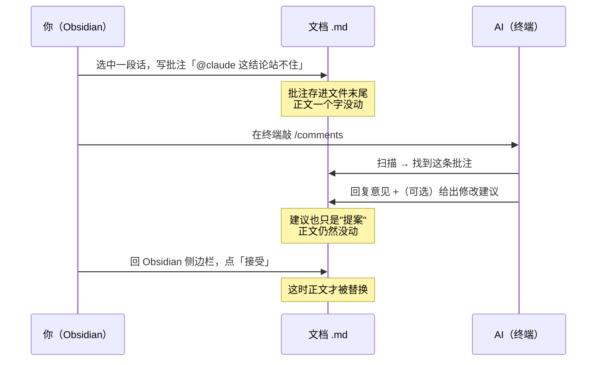
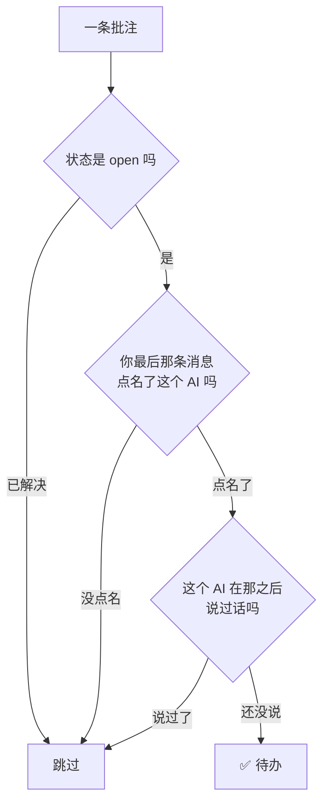
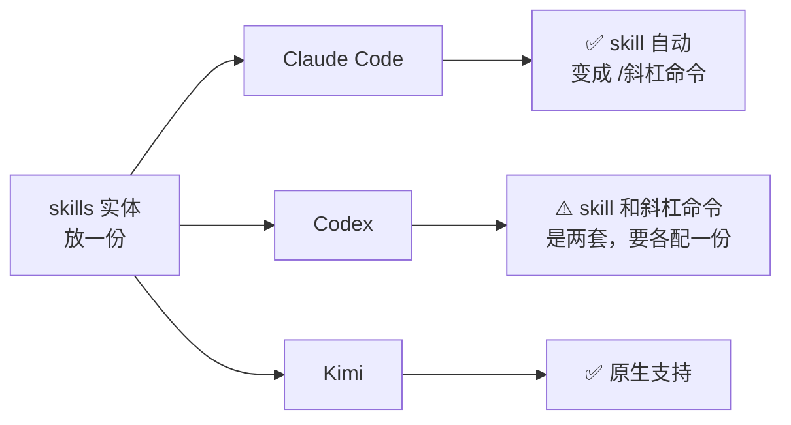

# 批注协作：在 Obsidian 里批注文档，让 agent 直接读懂你的意见

## 这解决什么问题

你让 AI 写了份方案，它写在一个 `.md` 里。你读的时候心里有一堆意见：这段结论站不住、那个方案漏了个情况、这里表述太绕。

**问题是：怎么把这些意见传回给 AI？**

现在多数人的做法是回到终端，用嘴复述一遍：「第三段那个降价的结论不对，你重写一下」。这有三个毛病：

1. **你得重新描述位置。**「第三段」「中间那个表格下面」——说不清楚。
2. **你得重新组织语言。** 读的时候想到的话，隔了五分钟已经忘了一半。
3. **没有留痕。** 你提过什么意见、AI 改没改、改成什么样了，全在聊天记录里，翻不回来。

这套做法是：**你像批 Word 一样在文档上划线批注，AI 自己去读。**

意见就写在它该在的位置上，不用复述、不用描述位置、永久留在文件里。

## 效果长什么样



关键在最后两步：**AI 永远不直接改你的正文。** 它只能"提案"，落不落地是你点一下的事。

## 需要装什么

三样东西，十分钟搞定。

### 1. Obsidian 插件：Tandem Comments

在 Obsidian 的「第三方插件」市场里搜 **Tandem Comments** 装上并启用。

装完你就能：选中任意文字 → 右键「Add comment」→ 在右侧边栏写意见。

> 为什么选这个而不是别的批注插件？
> 市面上还有 Side Comments、Document Comments 等等。选它的**唯一理由**是：它把批注以**纯文本 JSON** 存在 `.md` 文件里。
> 像 Side Comments 那种「不污染源文件」的设计看着更干净，但批注存在插件自己的数据库里——**命令行读不到，AI 就看不见**，整套玩法就不成立了。

### 2. 一个 AI skill：让 AI 看懂这个格式

插件设置里 `Settings → Tandem Comments → Advanced & integrations` 可以导出一份 skill 文件，把批注格式教给 AI。

### 3. 一个工作流 skill：让 AI 知道去哪找批注

上面那个只教格式，不教「什么时候去看」。这个由本仓库提供——`skills/comments/`，跑一次 `bin/sync-skills.sh` 就装好了：扫描整个笔记库 → 找出点名你的批注 → 逐条处理。

两者分工明确：插件导出的那份管**格式**（批注长什么样），本仓库这份管**流程**（去哪找、怎么答、什么时候停下来问你）。插件升级重新导出时不会冲掉工作流。

## 怎么用

### 最简单的用法

1. 在 Obsidian 里选中一段话，加批注，写上 **`@claude`**
2. 在终端敲 `/comments`
3. AI 扫描、回复，你回 Obsidian 看

批注里写 `@claude` 是**点名**。不写就只是自己的笔记，AI 不会来管——这样你可以放心地把私人备注和给 AI 的指令混在一个文档里。

### 多个 AI 分工

如果你同时在用几个 AI，可以按长处点名：

| 你写 | 谁会接 |
|---|---|
| `@claude 这段帮我重写` | 只有 Claude |
| `@codex 这个并发写法对吗` | 只有 Codex |
| `@kimi 这句中文别扭` | 只有 Kimi |
| `@ai 随便谁看一眼` | 谁先跑到谁接 |

**同一个文档、同一份批注，几个 AI 各取所需，不会重复劳动。**

判定逻辑是这样的：



第三个判断很重要：**你在 AI 回复之后再追问一句，它会自动重新变成待办。** 所以可以像聊天一样一来一回。

## 为什么正文不会被弄脏

批注不是插在正文里的，是集中存在文件**最末尾**的一个代码块里：

````markdown
（你的正文，一个字都没变）

````

`anchor` 是「引用原文 + 前后各二十来个字」，靠这个定位批在哪儿。所以：

- **正文永远是干净的 Markdown**，拿去发布、导出、给别人看都不带批注
- **AI 不需要装任何插件**，能读文件就能看见你的意见
- **Obsidian 阅读模式下批注是隐藏的**，不影响正常看文档

## 各家 CLI 的差异（踩过的坑）

这块最容易卡住，单独说。



**Claude Code**：装好即用，skill 自动获得同名斜杠命令。

**Codex**：这里有个坑。Codex 把两件事分开了——

- `~/.codex/skills/` 里的 skill 是**给模型搜索调用的**。你说「处理一下批注」它能自己找到。
- 你**手打** `/comments` 走的是另一套：`~/.codex/commands/*.md`。

所以在 Codex 里 skill 装好了照样打不出斜杠命令，得再写一个几行的命令文件指向它。（顺带：Codex 里 `/card` 之类也是同理。）

**Kimi**：原生支持，装到 `~/.kimi-code/skills/` 即可。

> 本仓库的 `bin/sync-skills.sh` 就是这么做的：skill 实体只有一份，软链进三家的 skills 目录。**改一处，三端同步**，`git pull` 后自动生效，不用重装。

## 几条实践经验

**AI 不要自动 resolve 批注。** 在这个格式里，resolve 等于**删除**这条批注。AI 答完就顺手 resolve，你还没看见它的回复，批注就没了。让它只回复，resolve 由你来点。

**AI 不要直接改正文。** 有意见就写 `suggestion`（修改建议），你在侧边栏审完点接受。这是整套设计的意义所在——**审阅权在人手里**。

**时间戳一定要取真实时间。** AI 如果凭感觉填个时间，可能比你的提问还早，侧边栏排序就乱了，看起来像它未卜先知回答了你还没问的问题。

**署名要用自己的名字。** 多个 AI 协作时，「谁答过了」全靠署名判断。有一个署错名，就会出现两个 AI 在同一条批注里反复抢答。

## 适合什么场景

最顺手的是**「AI 写初稿 → 你审 → AI 改」**这个循环：

- 方案文档、设计稿、周报——你读的时候顺手批，不打断阅读节奏
- 长文档尤其明显。二十页的东西，用嘴复述意见根本说不清位置
- 意见永久留在文件里，三个月后回头看还能知道当时为什么这么改

不太适合的：需要大改结构的时候。那种情况直接开个会话说清楚，比一条条批注快。

## 一句话总结

**把「审阅意见」从聊天记录里挪回文档上。** 位置自明、无需复述、永久留痕，而且 AI 不需要任何特殊集成就能读懂。
```tandem-comments
{
  "a1f3": {
    "anchor": { "exact": "大幅降价", "prefix": "三季度应该", "suffix": "，把量" },
    "status": "open",
    "thread": [
      { "author": "me", "ts": "...", "text": "@claude 这结论站不住" },
      { "author": "Claude", "ts": "...", "text": "同意，缺价格弹性测算……" }
    ]
  }
}
```
